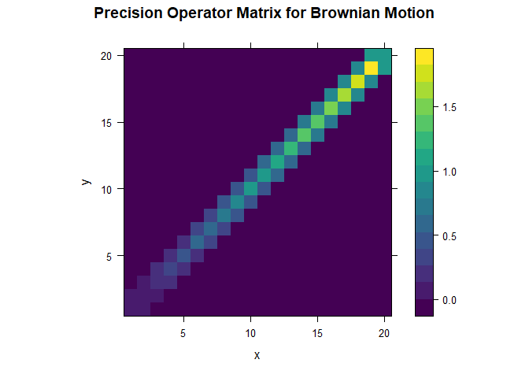

<!-- README.md is generated from README.Rmd. Please edit that file -->

# CIGM

<!-- badges: start -->
<!-- badges: end -->

The package provides functions for recovering finite resolution
approximations of conditional independence graphs of Gaussian processes.

## Installation

You can install the development version of CIGM from
[GitHub](https://github.com/) with:

``` r
# install.packages("devtools")
devtools::install_github("kgwstat/CIGM")
```

## Example

This is a basic example which shows you how to solve a common problem:

``` r
library(CIGM)
## basic example code
Range <- seq(0, 1, length.out = 100)
CovFn <- function(x, y) {min(x, y)}
M <- outer(Range, Range, Vectorize(CovFn))
P <- PrecisionOpMatrix(M, 10)
```

Here is the plot:

